<p align="center">
  <picture>
    <source media="(prefers-color-scheme: dark)" srcset="banner.svg">
    <source media="(prefers-color-scheme: light)" srcset="banner-light.svg">
    
  </picture>
</p>

<p align="center">
  <code>ID MJNEUROART</code> · <code>SECTOR PARIS</code> · <code>GENERATIVE SINCE 2022</code> · <code>MODE AGENT-DRIVEN</code>
</p>

### // IDENT

**mjneuroart** = MJ · neuro · art. Mike-Jeason, Paris.

Neural tools in one hand, an artist's eye in the other, since 2022. I build with agents: pipelines, skills, harnesses, and memos that any agent can pick up and resume.



### // STACK

`Claude Code` `Python` `Node` `ffmpeg` `Blender` `Vercel` `GitHub Actions`


### // PROTOCOL

```text
> a script that was not run is not shipped
> a visual is checked by eye, not by code
> every number has a source
> a rule corrected twice becomes a rule
```


### // ACTIVITY

<p align="center">
  <picture>
    <source media="(prefers-color-scheme: dark)" srcset="https://raw.githubusercontent.com/mjneuroart/mjneuroart/output/github-snake-dark.svg">
    
  </picture>
</p>


### // UPLINK

X [@Jeason4X](https://x.com/Jeason4X) · terminal [mjneuroart.github.io/mjneuroart](https://mjneuroart.github.io/mjneuroart/)

<p align="center"><sub><code>mj // neuro // art</code> · the HUD above rebuilds itself every night</sub></p>
